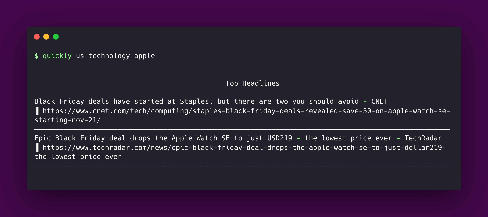

# Quickly CLI 📰 💻 🚀

## Description 📚

`quickly` is a command line tool build with Rust that lets you search for headlines news based in a country, category and query.

It uses the [News API](https://newsapi.org/) to fetch the headlines from sources
and blogs around the world.

Currently supported countries: 🇧🇷 🇫🇷 🇬🇧 🇺🇸



## Installation 👷‍♀️

#### First, you need to clone the repository

```
$ git clone https://github.com/LuisCardosoOliveira/quickly.git
$ cd quickly
```

#### Supposing that you already have Rust installed, compile the package

```
$ cargo build --release
```

#### Run the program

```
$ ./target/debug/quickly <COUNTRY> <CATEGORY> <QUERY>
```

#### Requirements


## Usage

```
$ ./target/debug/quickly --help

Quickly 0.1.0

Luis C. <luis@luiscardoso.dev>

Quickly is a simple CLI that lets you search for headlines news.

USAGE:
    quickly [ARGS]

ARGS:
    <COUNTRY>     The 2-letter ISO 3166-1 code of the country you want to get headlines for.
                  [default: us] [possible values: br, fr, gb, us]
    <CATEGORY>    The category you want to get headlines for. [default: technology] [possible
                  values: business, entertainment, general, health, science, sports, technology]
    <QUERY>       Keywords or a phrase to search for.

OPTIONS:
    -h, --help       Print help information
    -V, --version    Print version information
```

## Contributing 🤖

If anything feels off, or if you feel that some functionality is missing, feel
free to contribue.

## License

MIT © [Luis Cardoso](https://twitter.com/LuisFCCO)
